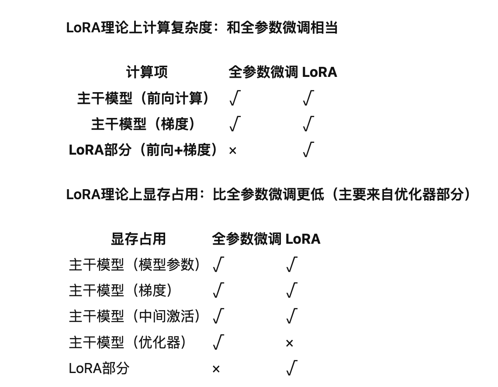

# Lora权重分析

## 具体可以参考下面博主介绍
- https://www.zhihu.com/tardis/bd/art/666000885?source_id=1001

## 结论
- 理论上Lora和全参微调计算复杂度相当
- 理论上显存占用比全参数微调更低（主要来自优化器部分）
- 但是，在实际的大模型训练过程中，LoRA的训练速度比全参数微调更快，显存占用也小很多

- Adapter、P-Tuning、LoRA 等，它们只需要微调很少的参数，就能达到和全量参数微调相近的效果。但是，这些技巧**并不是训练高效**的，因为它们仍然**需要在整个模型中进行反向传播**，才能得到少数可训练参数的梯度。也就是说，虽然可训练的参数减少了很多，但是训练速度并没有明显提高
    

